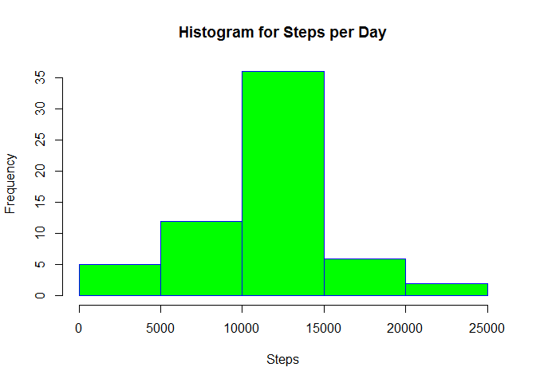

# Reproducible Research: Peer Assessment 1

  
## Loading and preprocessing the data

```r
data <- read.csv('activity.csv')
```
<br>

#### Show a small set of the data

```r
head(data,5)
```

```
##   steps       date interval
## 1    NA 2012-10-01        0
## 2    NA 2012-10-01        5
## 3    NA 2012-10-01       10
## 4    NA 2012-10-01       15
## 5    NA 2012-10-01       20
```
<br>

## What is mean total number of steps taken per day?
  
#### Calculate the total number of steps taken each day

```r
steps_per_day <- aggregate(steps~date,data,sum)
```
<br>

#### Make a histogram of the total number of steps taken each day

```r
hist(steps_per_day$steps, main="Histogram for Steps per Day", xlab="Steps", border="blue", col="green")
```

<!-- -->
  
#### Report the mean and median of the total steps taken per day

```r
options(scipen = 1, digits=3)
the_mean <- mean(steps_per_day$steps)
the_median <- median(steps_per_day$steps)
```
**ANSWER: The mean of total steps per day is 10766.189 and the median of total steps per day is 10765  **
<br>
<br>

## What is the average daily activity pattern?  
#### time series plot of 5 minute interval and the average number of steps

```r
avg_steps_by_interval <- aggregate(steps~interval,data, mean)
plot(avg_steps_by_interval$interval, avg_steps_by_interval$steps, type="l", xlab="5 minute interval", 
     ylab="Avg Steps Across All Days",
     main="Time Series Plot of 5 Minute Interval and the Avg Number of Steps")
```

<!-- -->
  
#### Which 5-minute interval, on average across all the days in the dataset, contains the maximum number of steps?

```r
max_steps <- max(avg_steps_by_interval$steps)
max_steps_interval <- avg_steps_by_interval[which(avg_steps_by_interval$steps == max_steps),]$interval
```
**ANSWER: The maximum average steps of 206.17 is at interval 835**
<br>
<br>

## Imputing missing values
####Calculate and report the total number of missing values in the dataset (i.e. the total number of rows with NAs)

```r
total_na <- sum(is.na(data$steps))
```
**ANSWER: The number of missing values for steps is 2304**
<br>

####Devise a strategy for filling in all of the missing values in the dataset. The strategy does not need to be sophisticated. For example, you could use the mean/median for that day, or the mean for that 5-minute interval, etc.
####Create a new dataset that is equal to the original dataset but with the missing data filled in.

```r
cleaned_data <- data
cleaned_data$steps[is.na(data$steps)] <- avg_steps_by_interval$steps[match(data$interval[is.na(data$steps)],avg_steps_by_interval$interval)]
```
####Make a histogram of the total number of steps taken each day and Calculate and report the mean and median total number of steps taken per day. 

```r
steps_per_day <- aggregate(steps~date,cleaned_data,sum)
hist(steps_per_day$steps, main="Histogram for Steps per Day", xlab="Steps", border="blue", col="green")
```

<!-- -->

```r
options(scipen = 1, digits=3)
the_mean <- mean(steps_per_day$steps)
the_median <- median(steps_per_day$steps)
```
The mean of total steps per day is 10766.189 and the median of total steps per day is 10766.189.

<br>

####Do these values differ from the estimates from the first part of the assignment? What is the impact of imputing missing data on the estimates of the total daily number of steps?

**ANSWER: The mean did not change, while the median went up slightly.  There was minimal impact**

## Are there differences in activity patterns between weekdays and weekends?

####Create a new factor variable in the dataset with two levels - "weekday" and "weekend" indicating whether a given date is a weekday or weekend day.

```r
cleaned_data$date <- as.Date(cleaned_data$date)
weekdays1 <- c('Monday', 'Tuesday', 'Wednesday', 'Thursday', 'Friday')
cleaned_data$isWeekday <-factor((weekdays(cleaned_data$date) %in% weekdays1), levels=c(FALSE, TRUE), labels=c('weekend', 'weekday'))
```

####Make a panel plot containing a time series plot (i.e. type = "l") of the 5-minute interval (x-axis) and the average number of steps taken, averaged across all weekday days or weekend days (y-axis). See the README file in the GitHub repository to see an example of what this plot should look like using simulated data.

```r
library(lattice)
```

```
## Warning: package 'lattice' was built under R version 3.1.3
```

```r
avg_steps_by_interval <- aggregate(steps~interval+isWeekday,cleaned_data, mean)
xyplot(steps~interval|isWeekday,
       type='l',layout=c(1,2),
       data=avg_steps_by_interval,
       xlab='Interval',ylab='Avg Steps',
       main="Time Series Plot of 5 Minute Interval and the Avg Number of Steps")
```

<!-- -->

**ANSWER: As can be seen in the plots, people become active later on weekends, but are consistently active throughout the day**
