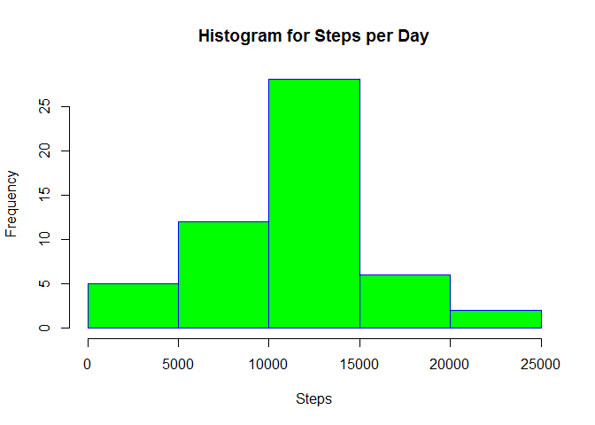

# Reproducible Research: Peer Assessment 1


## Loading and preprocessing the data

```r
data <- read.csv('activity.csv')
```

#### Get a summary of the data

```r
summary(data)
```

```
##      steps                date          interval     
##  Min.   :  0.00   2012-10-01:  288   Min.   :   0.0  
##  1st Qu.:  0.00   2012-10-02:  288   1st Qu.: 588.8  
##  Median :  0.00   2012-10-03:  288   Median :1177.5  
##  Mean   : 37.38   2012-10-04:  288   Mean   :1177.5  
##  3rd Qu.: 12.00   2012-10-05:  288   3rd Qu.:1766.2  
##  Max.   :806.00   2012-10-06:  288   Max.   :2355.0  
##  NA's   :2304     (Other)   :15840
```

## What is mean total number of steps taken per day?

#### Calculate the total number of steps taken each day

```r
steps_per_day <- aggregate(steps~date,data,sum)
head(steps_per_day)
```

```
##         date steps
## 1 2012-10-02   126
## 2 2012-10-03 11352
## 3 2012-10-04 12116
## 4 2012-10-05 13294
## 5 2012-10-06 15420
## 6 2012-10-07 11015
```

#### Make a histogram of the total number of steps taken each day

```r
hist(steps_per_day$steps,
     main="Histogram for Steps per Day", 
     xlab="Steps", 
     border="blue", 
     col="green")
```

<!-- -->

#### Report the mean and median of the total steps taken per day

```r
options(scipen = 1, digits=3)
the_mean <- mean(steps_per_day$steps)
the_median <- median(steps_per_day$steps)
```
The mean of total steps per day is 10766.189 and the median of total steps per day is 10765

## What is the average daily activity pattern?


## Imputing missing values


## Are there differences in activity patterns between weekdays and weekends?
